# The Reactor — talk outline

Source of the deck: each `###` below is one slide, its image is the slide, its bullets are the
speaker notes (press `S`). `##` headings produce nothing. `npm run build` after editing.

Quoted lines are from the three Medium deep dives: I (Document Models and The Reactor),
II (Reconciling local-first event streams), III (Optimizing distributed synchronization, draft).

Timing: 20 min. Opening 2, Act I 4, Act II 3, Act III 8, Act IV 3.

---

## 

### The Reactor

A structured runtime for local-first applications.

- Hands-on tech lead. About a year at Powerhouse on this runtime.
- I: "Powerhouse provides a local-first tool-set that allows open organizations to collaboratively coordinate people, code and capital."
- I: "our goal is to provide users true agency and ownership, without sacrificing the typical merits of centralized services."
- I: "We are aiming for the convenience of a centralized SaaS with the sovereignty of local-first."

## The Vision

### The Vision

### Business Processes as Documents

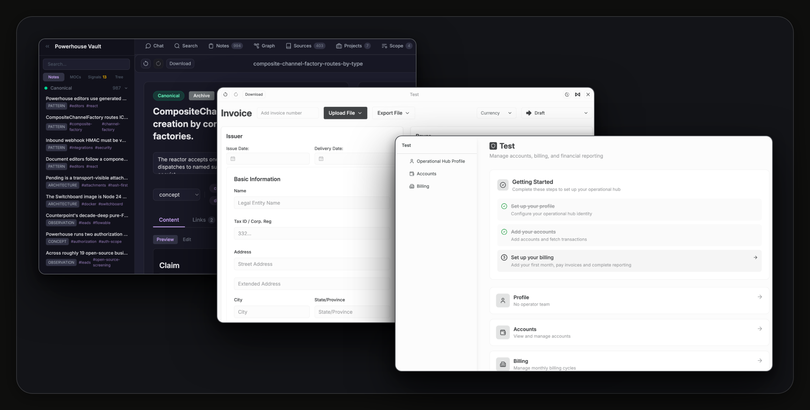

- The vision of Powerhouse was to enable anyone to create bespoke documents that could model
  many types of artifacts: an invoice, a wiki page, or even an internal business process or
  workflow.

### ... and the Operations on them

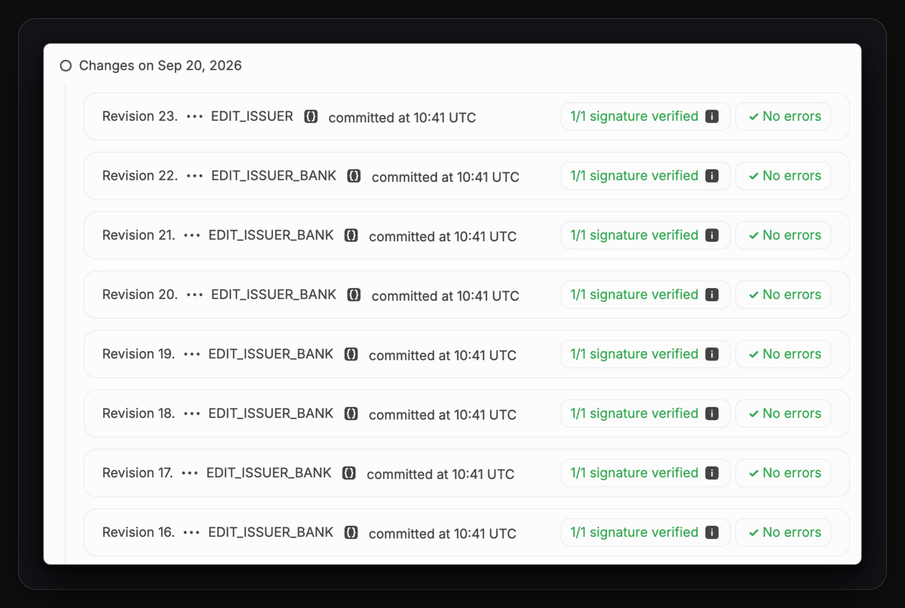

### ... created by "Citizen Builders"

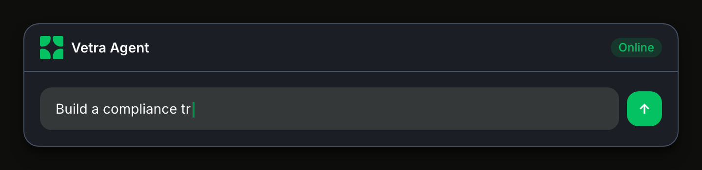

- On top of this, Powerhouse wanted a chatbot sort of interface for businesses to build out
  these use cases.

## Technical Requirements

### Technical Requirements

### It must... run everywhere

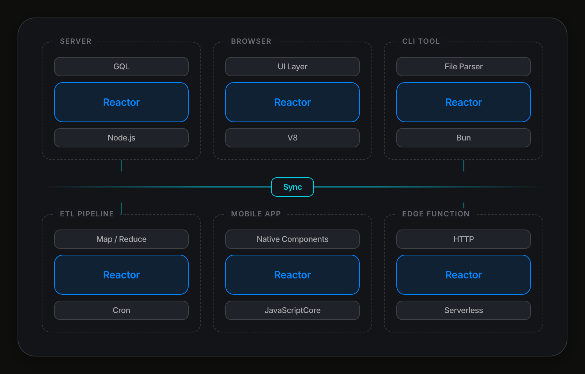

- The very core component of this stack is called The Reactor. The demand was that this sit
  anywhere, sync with any other Reactor, and execute the logic and verification of these
  different business processes.
- I: "able to run serially without impeding the render thread of a browser while also able to
  scale horizontally in a server environment."

### It must... be local first

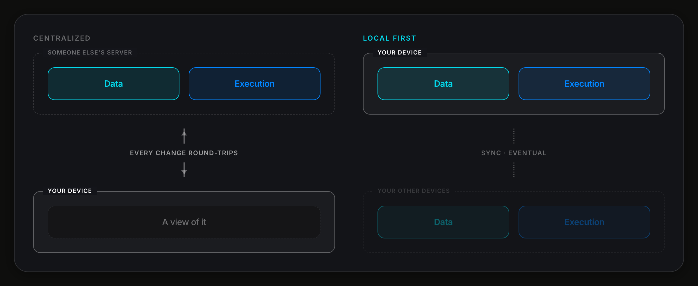

- Both the data and the execution must be locally owned by the user.
- Sovereignty and responsiveness.

### It must... have signed audit trails

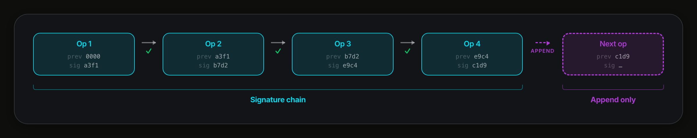

- "each Reactor must write to append-only storage"
- "the stream of operations form a signature chain"

### It must... be multi-user by default

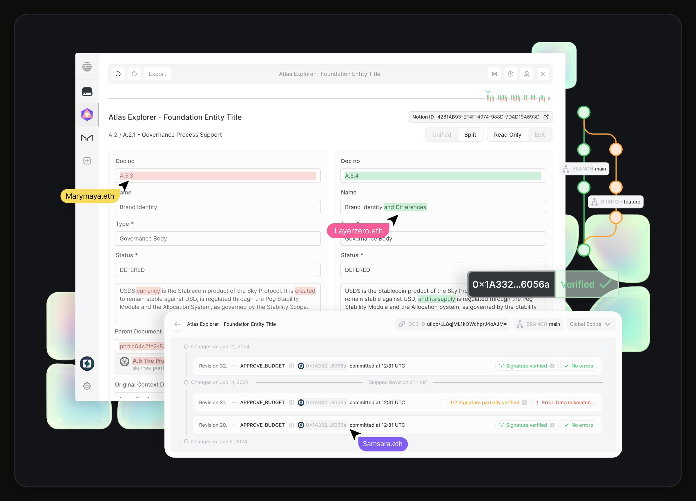

- All applications built on this stack must be inherently realtime multi-user.

## Act I — Document Models

### Document Models

### Inspiration: reducers

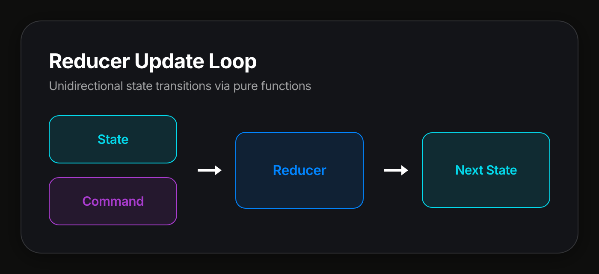

- I: "a function, called a reducer, takes a state object and a command and outputs the next
  state."
- I: "The flux pattern breaks down every state change into simple data and pure functions,
  making them extremely easy to isolate and test."
- I: "how do you reconstruct state if you didn't already have it, and secondly (though related),
  how would you synchronize state between multiple users, especially given the constraint of
  append-only storage? Oh and a nit-picky third: how the heck do you scale this approach?"

### Inspiration: Event sourcing

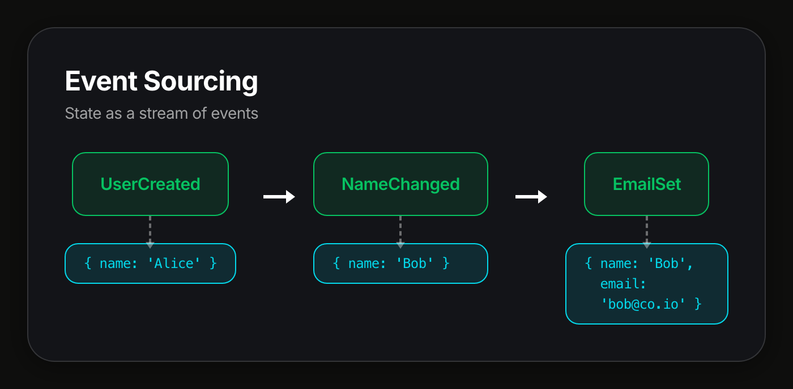

- I: "This architecture describes an object's state not as some explicit object, but as a
  stream of the events that create the object."
- I: "All the sudden we don't just have a username, we have an entire history of usernames along
  with descriptive reasons why the username changed at all."

### Inspiration: Aggregates

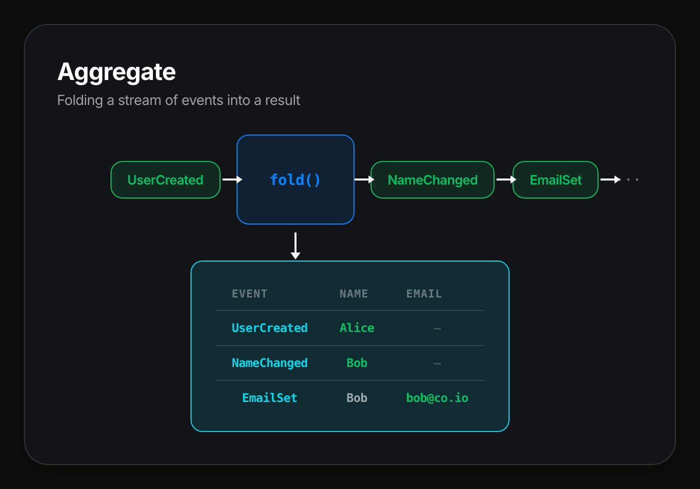

- I: "we could move along an event stream and count the number of times the username was
  changed. That would create a single number: an aggregate."
- I: "we don't really need to know what aggregates we'll need when we launch. We could ship the
  product, have it in production for three years, and only then think about unique-for-all-time
  usernames."

### Event -> Command sourcing

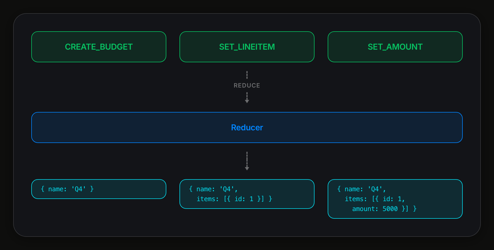

- I: "in command sourcing, we don't store the output, we store the command. The difference seems
  slight but we are aiming for both the data and the execution to be locally owned by the user.
  This means that each user needs to be able to run the command itself to get the resulting
  state change."

### The Document Model

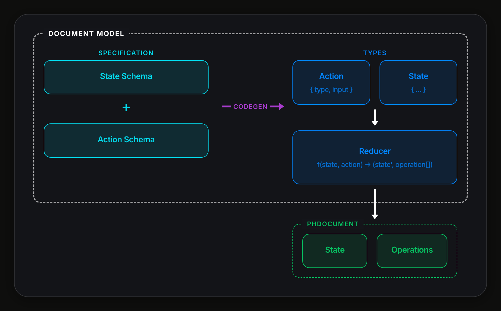

- I: "A Document Model defines the shape of documents and the logic that can be executed to
  change (or mutate) a document's state. They are defined in three parts: a state schema, an
  action schema (the shape of mutation payloads), and a reducer which applies actions to the
  state."
- Left: schema first, codegen gives types and reducer stubs. Right: reducer emits a PHDocument,
  "a stream of Operations and the state produced by them."
- I: "We use the term Operation to refer to the result of an applied Action." Action is the
  signed intent; Operation is the result.
- I: "Document Models are themselves documents."

## Act II — The Reactor

### The Reactor

### CQRS

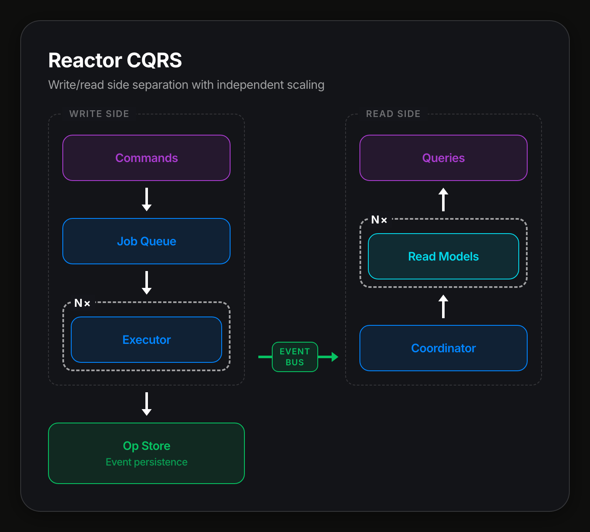

- I: "the actual management and execution runtime is called The Reactor."
- I: "this pattern separates writes and reads, allowing us to operate and scale each end of The
  Reactor independently (at the slight cost of consistency)."
- Write side: queue into N executors running the authored reducers. I: "These executors are
  'location transparent'... we could run them pretty much anywhere: in worker, a different
  process, or on some other machine in a faraway place."
- Event bus. I: "intended to be in-memory while running in a browser (this part is deployed),
  and something more robust in a server environment, like RabbitMQ (this part is not deployed)."
- Read side: a coordinator hands `Operation[]` to read models.

### Writes

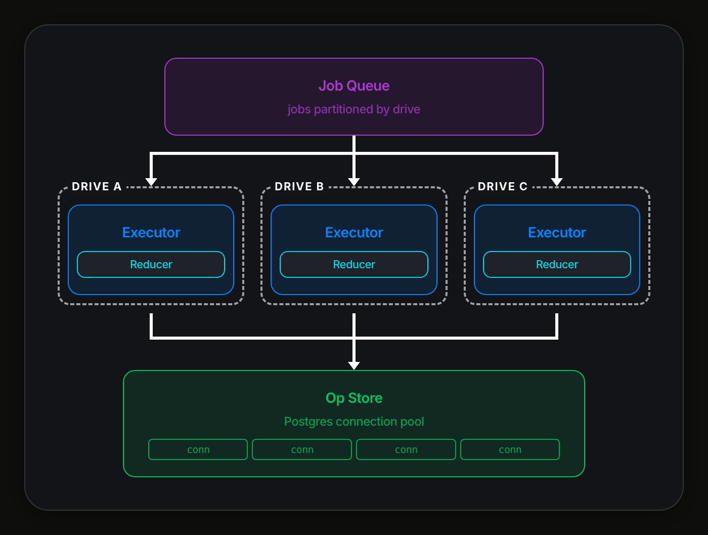

### Read models

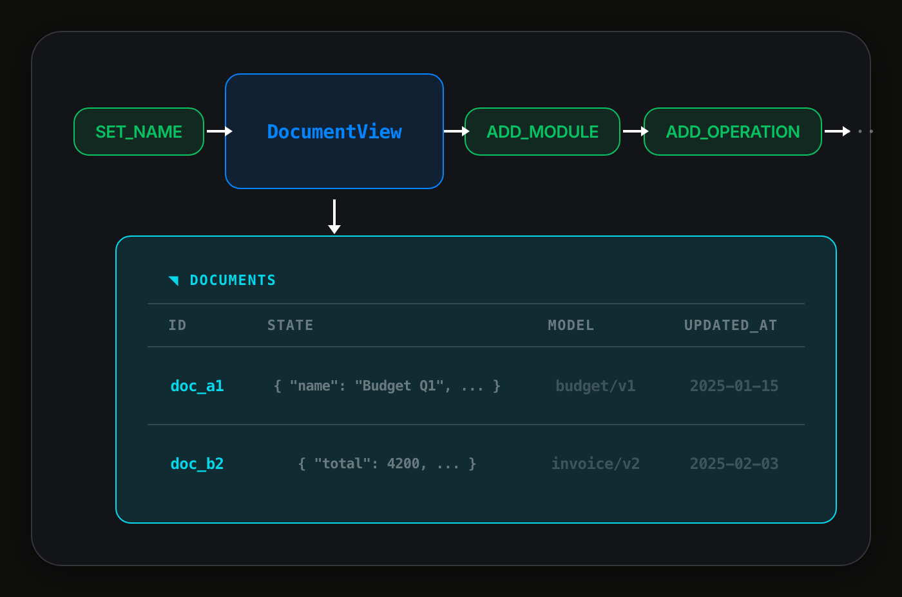

- I: "The built-in DocumentView is a read model... that builds a table of latest document state
  in a Postgres table."
- I: "The authoritative store of operations could be the slowest blockchain on the moon, but we
  would still get fast reads from a turbocharged read model."
- Also built in: DocumentIndexer, "a graph of relationships between documents."

### Read models

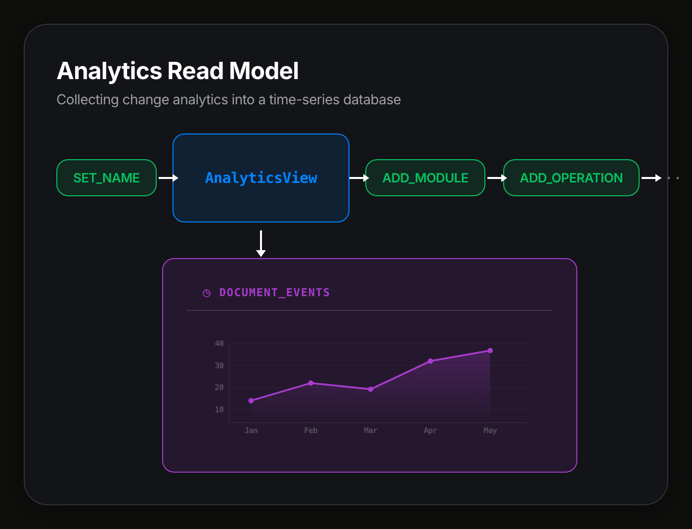

- I: "our document analytics read model... collects analytics information about how documents
  are being changed and how... This data is stored in a completely separate time-series
  database. Reactor don't care."

## Act III — Sync

### Sync

#### The ask, restated (no slide)

- II: "users want to be able to see each other's work, as close to real-time as possible — but
  they also want to work without hiccups when BART passes under the bay or when their toddler
  unplugs the router."

### How games do it

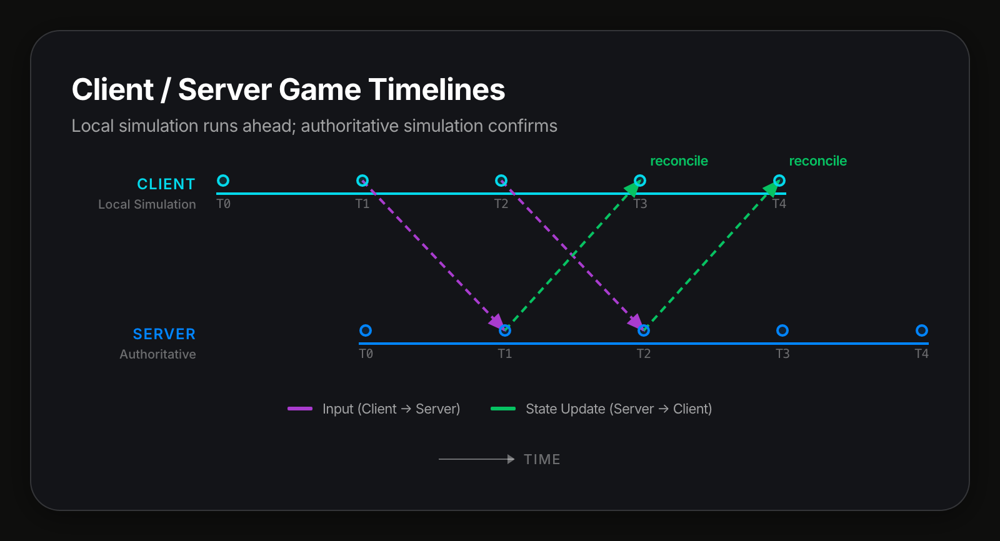

- II: "real-time multiplayer video games were 'local-first' before it was cool."
- II: "the client reconciles the difference between the state it calculated optimistically...
  and the state it received authoritatively at a later time. This is how you get shot around
  corners."
- II: "Authoritative games rely entirely on a centralized server. We want to make every Reactor
  authoritative. In addition, no one wants their work discarded when some other simulation
  'wins'." Fails 1 and 3.

### How Figma does it: CRDTs

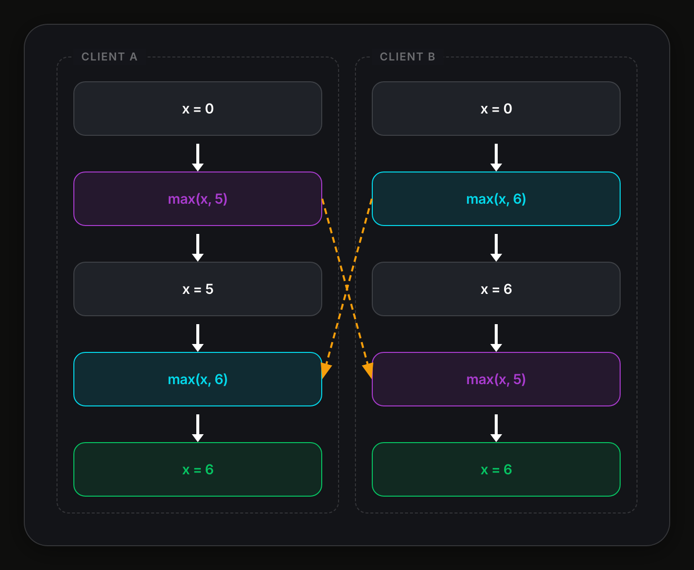

- Commutative
- II: "CRDTs allow users to do work local-first and eventually come to a consensus on what the
  result should be."
- `max(x, 5)` and `max(x, 6)` in either order give 6. Passes 1, 2 and 3.
- II: "This sounds like it could be a perfect fit for The Reactor!"

### Where CRDTs stop

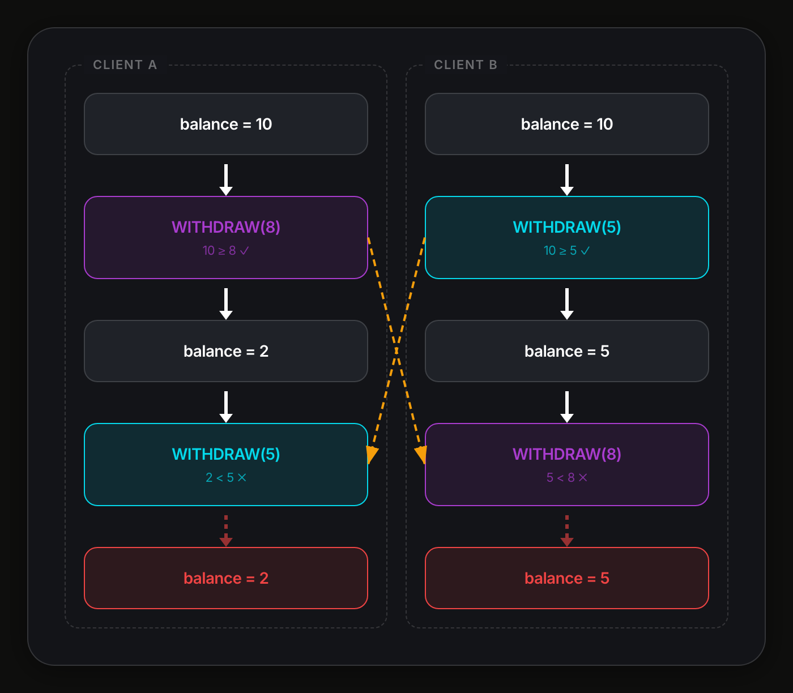

- II: "CRDTs do not generalize to the same degree that Flux reducers do. That is, you cannot
  replace every reducer with a CRDT."
- II: "thank God your bank doesn't use CRDTs."
- II: "CRDTs are fairly tricky primitives for developers to work with anyway." Reducers here are
  written by users. Fails the reducer requirement.

### How Google Docs do it: OT

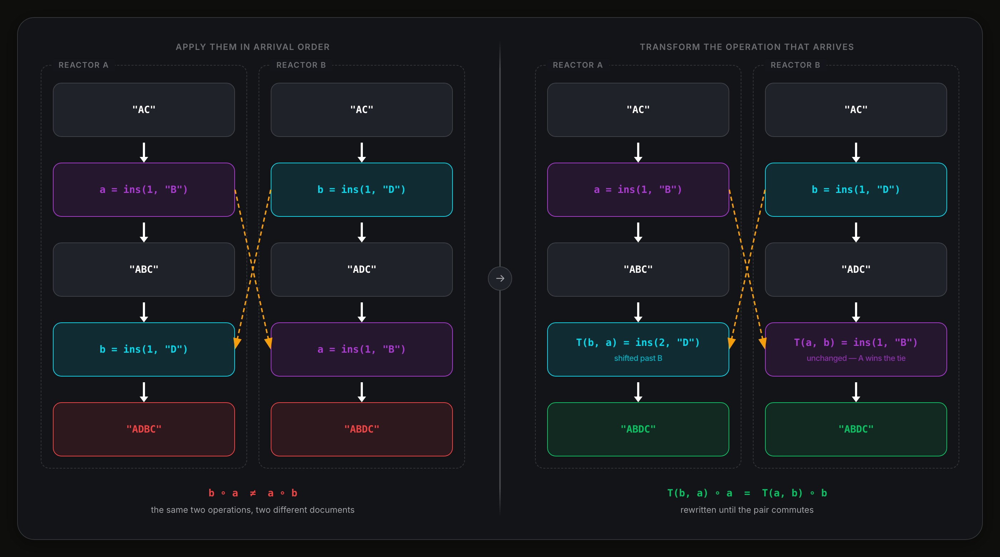

- Reordering is what forces the question. II: "If we reorder them, then we'd need to mutate the
  immutable operation. This is very similar to a technique called Operational Transformation
  (OT). This is what Google Docs uses, among other widely used tools."
- II: "In OT, you essentially rewrite operations coming from other clients so that they make
  sense. There is more to it than that (just like with CRDTs) but that's the gist."
- II: "OT has some similar rough edges to CRDT, in that they can be tricky to generalize."
- II: "if you are working on a document, particularly one with sensitive information, do you
  really want your mutations altered by someone else? Who gets to decide that anyway?" Fails 3.
- II: "each Reactor writes to append-only storage backends (like Swarm or Hypercore), so we
  can't actually go back and rewrite operations or their order." Fails 2.
- II: "We never rewrite a user's intent... We can create new Operations but we can never create
  new Actions. This is the main difference between Operational Reshuffle and Operational
  Transformation."

### The scorecard

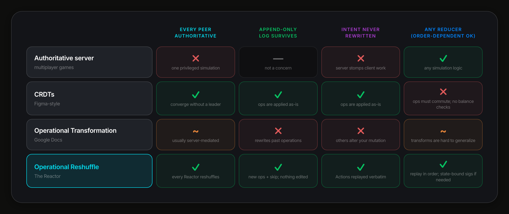

- II: "On the spectrum of CRDTs and OT, it lies much closer to the latter — with some important
  differences."

### Operational Reshuffle, step 1: sort

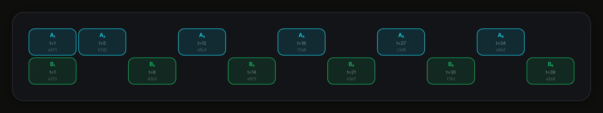

- II: "Operations cannot be changed, but we can create new ones." Requirement 2.
- II: "We never rewrite a user's intent... We can create new Operations but we can never create
  new Actions. This is the main difference between Operational Reshuffle and Operational
  Transformation." Requirement 3.
- Step 1: "we take event streams A and B and order them by timestamp."

### Step 2: find the merge base

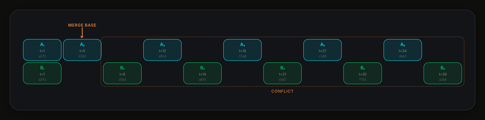

- II: "we walk from start to front to find where the streams diverge, relative to A."
- Same hash means same operation. First mismatch is the divergence. II: "In more familiar git
  terminology, this would be called the 'merge base'."
- II: "we now have 9 operations in a conflicted state: 4 from A and 5 from B."

### Step 3: replay from the merge base

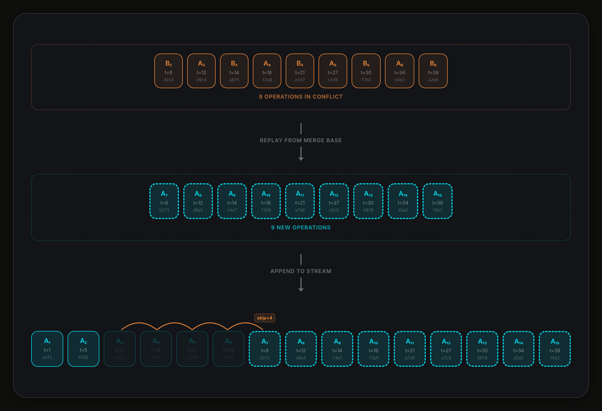

- Replay the 9 Actions in timestamp order. Nine new Operations.
- II: "the hashes of each of the new operations will be different than the original, but the
  timestamps remain the same... the ordinal is part of the hash."
- II: "This hash, however, is different than the signature (which itself is a hash) on the
  Action. That is, the user's intent did not change."

### Step 4: skip, then garbage-collect

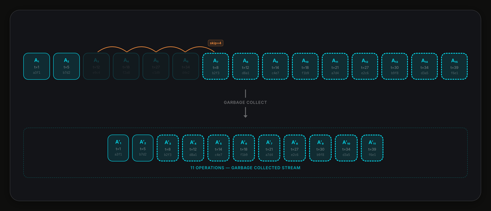

- II: "since 4 of these operations are already in A, they have already been written to the
  append-only operation store. Blast those fickle audit trails! We can't delete these, so
  instead we need to skip them."
- II: "the skip value of 4 on A₇ means that when we create a projection of this stream, we will
  skip the preceding 4 operations."
- II: "The operation stream with all of the skipped operations removed we call the garbage
  collected stream."

### Both sides converge

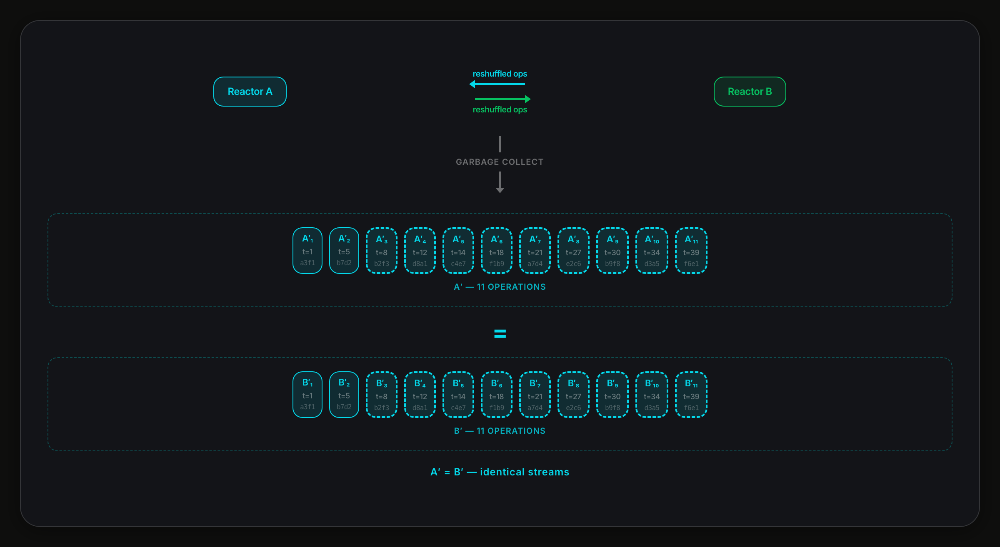

- Same procedure on both peers, exchange reshuffled ops, A′ = B′. Repeats as work continues
  (ping-pong, appendix).

### When reordering intent is itself unacceptable

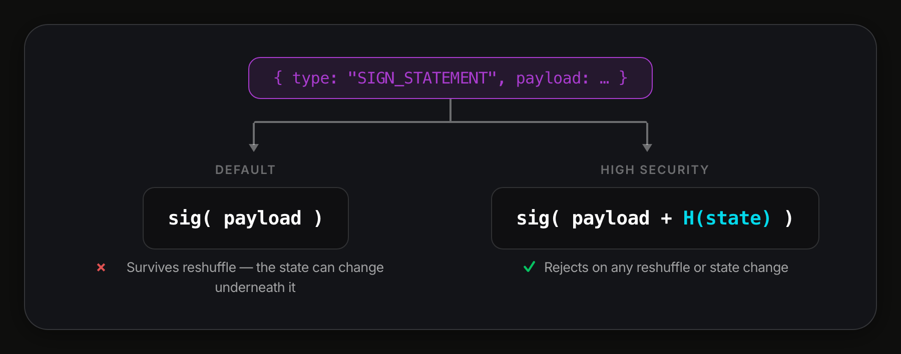

- II: "There are scenarios in which even re-ordering user intent is not desirable." Multiple
  parties sign a statement; if it changes, "the parties need to start over."
- II: "While we can technically sync all the changes into a consistent event stream, the
  semantic guarantees of the reducer would be broken."
- II: "By default, the action signature is only on the action payload, but in high security
  applications, we can also include a hash of the input state."
- Edge case: statement changes and changes back; hashes match again. Add the previous Operation
  id (appendix). II: "This type of signature will reject on any reshuffle and any state change."
- II: "Operational Reshuffle, by default, preserves intent through reshuffle and can optionally
  preserve resulting state change as well."

## Act IV — Over the network

### Over the Network

### Channels and mailboxes

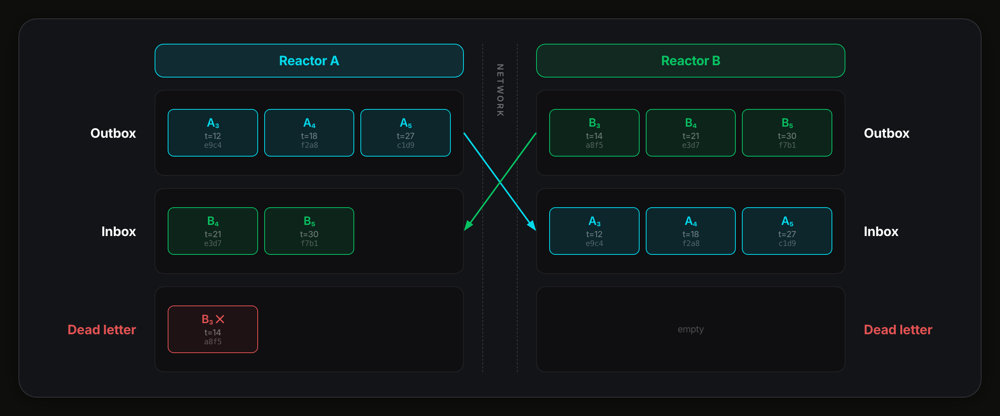

- One channel per pair of Reactors. Outbox, inbox, dead letter. All FIFO.
- III: "The dead letter mailbox holds operations that failed in a way that cannot be retried.
  These might result from a bad signature, a hash mismatch, or some other unrecoverable
  rejection."
- III: "Every operation a Reactor outputs is stamped with an ordinal: a monotonically increasing
  integer. These are not globally increasing, only locally increasing." "The ordinal is a total
  order over every operation the Reactor has ever seen, across all documents, in the order it
  saw them."

### The entire sync state is four integers

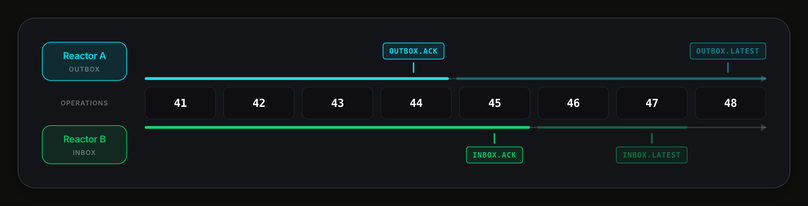

- III: "inbox.ack: the highest remote ordinal we have durably applied. inbox.latest: the highest
  remote ordinal we have seen. outbox.ack: the highest local ordinal the remote has durably
  applied. outbox.latest: the highest local ordinal we've produced that matches the filter."
- III: "That's it. The entire synchronization state between two Reactors is a measly four
  integers (if JS had integers)."
- III: "ack ≤ latest." "They only ever increase. There is no message, failure, or retry that
  moves a cursor backwards." "'Synced' just means ack == latest in both directions."
- III: "if the poll response gets lost due to some sort of network hiccup, we can simply ask
  again with the same cursors. The server re-sends everything after the ack. We can't miss
  operations, because ack only advances once we've actually applied them."
- III: "If we... push the same operations twice... the Reactor dedupes by action id."
- III: "What about a crash where the whole process dies? All the Reactor needs to do is read two
  cursors out of storage and resume. The mailboxes rebuild themselves."
- III: "delivery is at-least-once, application is idempotent, and progress is monotonic."

### One poll, both directions

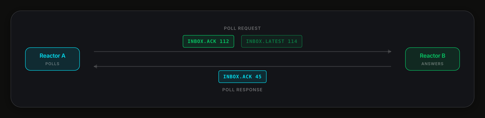

- III: "Acks piggyback on polls. There is no separate ack request... every message carries data
  in one direction and acknowledgment in the other."
- III: "Writes are buffered." Outbox holds ops "for a short window (or until a max batch size)."
  Batches respect dependencies: CREATE_DOCUMENT and UPDATE_DOCUMENT "need to be applied
  atomically."
- Polling for now. III: "obviously you wouldn't want to build Counter-Strike with polling."
- III: "At-least-once, not exactly-once. We chose duplicates-plus-dedup over some sort of
  complicated, distributed transaction scheme. Why make it complicated when you can make it
  simple?"
- III: "Mailboxes support pause, resume, and flush, so you can freeze a channel, let operations
  stack up, and step through them one at a time."
- III: "This has made sync simultaneously much simpler to debug at the slow speed of my brain and
  much faster to debug at the fast speed of an LLM exploring with tool calls."

## Close

### The case, restated

- Costs: eventually consistent reads; skipped operations stay in storage; at-least-once with
  dedup; timestamps decide merge order.

### Thanks

Questions?

---

## Appendix slides (only if asked)

### Reactor job pipeline

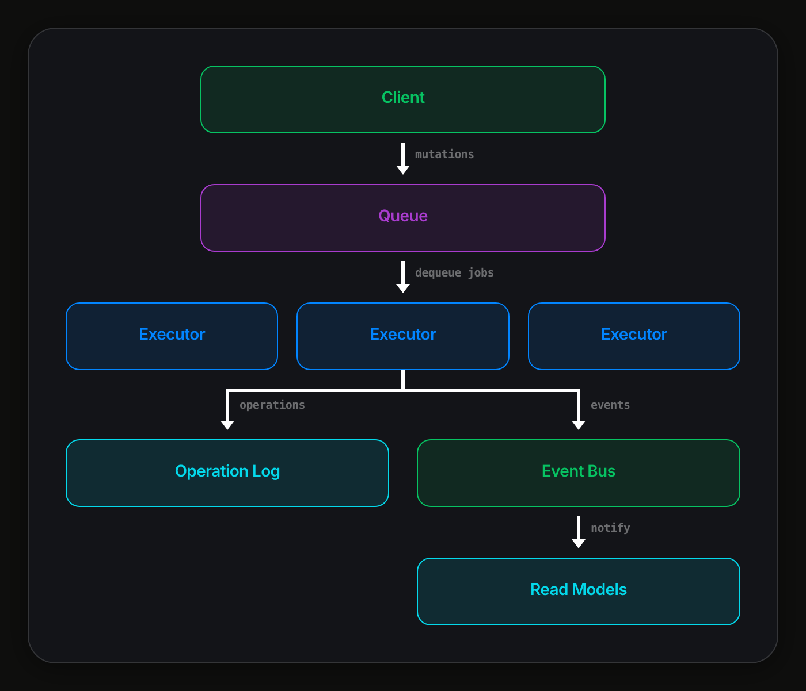

- Write side in more detail: mutations, queue, executors, operation log and event bus, read
  models.

### Critical-security signature

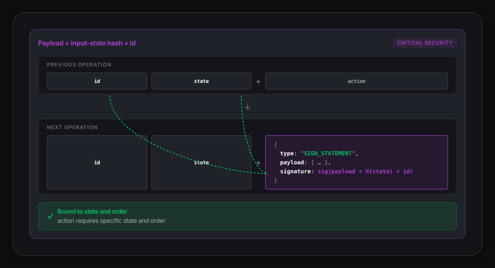

- II: "We can actually put one more thing in the Action signature if we really want to lock it
  down: the previous Operation id."
- II: "Since the Operation id is actually a composite id that includes a monotonically
  increasing index... This type of signature will reject on any reshuffle and any state change."

### Ping-pong: rounds of convergence

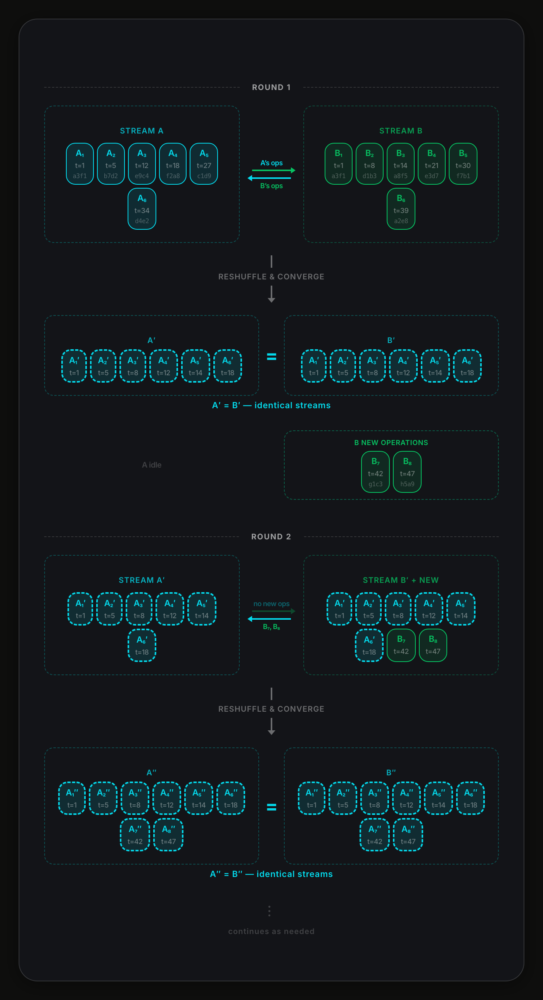

- Round 1 converges to A′ = B′. B keeps working. Round 2 converges to A″ = B″.

### One-way sync

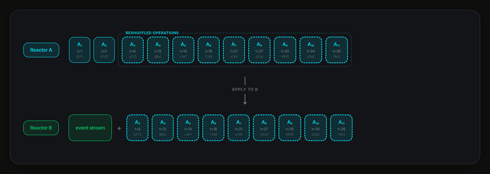

- A reshuffles; B applies A's new operations onto its stream.

---

## Gaps to fill before the talk

Part III is a draft and the export I had was truncated. Named in the draft, detail missing:

- "Touch-and-poll": what `touchChannel` does versus a poll, and when it fires.
- Filters: "Each dimension is a membership test, and an empty value means 'no restriction'."
  Which dimensions?
- Outbox buffering: how dependencies beyond create/update are handled.
- The "For next time" ending: "the bane of every distributed scheme is our old pal, Physics."
- A real screenshot of the Channel Inspector would beat the poll diagram.

## Likely discussion questions

- Are the three requirements real or self-imposed? Which would you relax first, and for what?
- Why not CRDTs with an escape hatch for order-dependent cases?
- Clock skew and backdated timestamps. Not covered in the articles; state-bound signatures are
  part of the answer for high-stakes documents.
- How stale can a read model be, and how does a UI know?
- Skipped operations stay forever. Storage growth, snapshots, compaction?
- What actually ships for executor placement and the server event bus, versus the design.
- Polling vs WebSockets; the latency users see.
- Why at-least-once and not exactly-once.
- Keeping user-authored reducers deterministic across peers.
- Testing the protocol: pause, resume, flush, manual poll; stepping through with an LLM.
- What you'd change.
