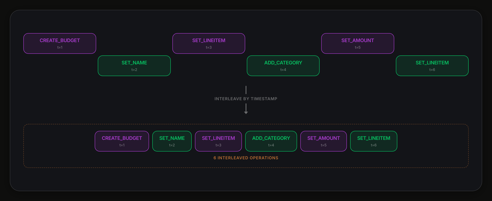
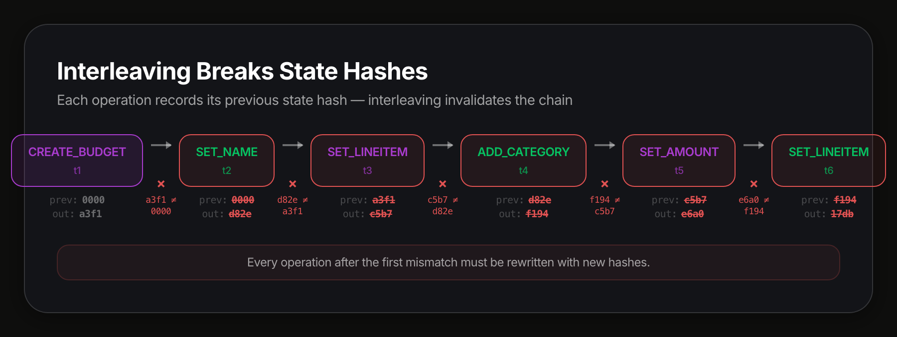

# The Reactor — talk outline

A 20-minute walk through Powerhouse's local-first document runtime, told almost entirely in
diagrams. This file is the single source of truth for the deck: `bin/build.mjs` turns every
`###` heading below into one slide (its first `img/` image becomes the slide; its bullets become
speaker notes, visible in reveal's speaker view via `S`). `##` headings are structure for the
reader and produce no slides. Edit here, then `npm run build`.

Source material: the two published deep dives and the in-progress third
(Medium: "Document Models and The Reactor", "Reconciling local-first event streams",
"Optimizing distributed synchronization"). Nothing below goes beyond what those say; the gaps
are flagged at the end.

Timing target: 20 min total. Act I ≈ 5, Act II ≈ 4, Act III ≈ 8, Act IV ≈ 3. Most slides
are 30–60 s; the four reshuffle steps are one idea told in four frames and should move fast.

---

## Opening (1 min)

### The Reactor

Local-first documents that sync.

- Who I am in one breath: hands-on technical lead; ~1 year at Powerhouse on this runtime.
- Powerhouse: local-first tooling for open organizations to coordinate people, code, and capital.
  Products on top: Achra (coordination hub), Vetra (data + workflows), identity, payments, an AI
  agent. All of it sits on the thing in this talk.
- The product stance that drives the engineering: agency and ownership for the user, without
  giving up the convenience of centralized SaaS. That sentence is the whole design constraint.
- Framing for a non-domain audience: think "git for structured documents, that also syncs live."

### The ask

- Same runtime, everywhere: browser, Node server, CLI, mobile, edge, ETL. Data *and*
  execution live on the user's machine first; sync is eventually consistent.
- Two very different performance envelopes from one codebase: run serially without blocking a
  render thread in a browser, and scale horizontally on a server across many documents.
- Every one of these is a full peer — there is no privileged copy. Hold that thought for Act III.

## Act I — Document Models (5 min)

### Where we started: the reducer

- If you know flux/redux you know this: a pure function takes state + a command and returns the
  next state. Every change is plain data plus a pure function: trivial to isolate and test.
- What flux papers over: (1) how do you reconstruct state you never had, (2) how do you sync
  state across users on append-only storage, (3) how does it scale.

### Event sourcing: state as a stream

- Older idea than flux: don't store the object, store the stream of events that made it.
- Payoff: state at *any* point in time, with the reasons attached. Not just a username; the
  whole history of usernames and why each changed.

### Aggregates: many views from one stream

- Walk the stream with a `fold()` and you can build anything: a count, a table, an index.
- The killer property: you don't need to know which aggregates you'll want at launch. Ship,
  run for three years, then rebuild a brand-new view from the beginning of the stream.

### Command sourcing: store the intent, not the result

- Our twist: we store the *command* (we call it an Action), not the event it produced.
- Why: both the data and the execution must be locally owned. Each user's machine runs the
  reducer itself to get the resulting state. This changes the shape of the reducer slightly.

### The Document Model

- Three parts: a state schema, an action schema, and a reducer that applies actions to state.
- Left: the spec. Author schema first; codegen gives you types, reducer stubs, and validation.
- Right: the reducer emits a PHDocument, which is the stream of Operations plus the state they
  produce. Operation = an applied Action plus metadata (ordinal, timestamp, hash). This
  Action-vs-Operation split is the hinge of Act III.
- Document Models are themselves documents: changing a schema is an action in an operation
  stream. Like git hosting its own source.

## Act II — The Reactor (4 min)

### The runtime: CQRS

- The Reactor is the management and execution runtime for Document Models.
- Reads and writes are separated so each side scales independently. The price is a little
  consistency: reads are asynchronous projections. Be upfront about that tradeoff.
- Write side: a queue feeds N executors that run the user-authored reducers. Reducers are pure,
  so executors are location-transparent: in-process, a worker, another process, another machine.
  In a browser, that's one executor cranking in serial.
- Middle: the event bus carries operations from writes to reads. In-memory in the browser; a
  real broker (e.g. RabbitMQ) is the plan for server deployments, not yet shipped.
- Read side: a coordinator hands `Operation[]` to read models. Read models are aggregates,
  CQRS-flavored.

### A read model: DocumentView

- Built-in read model: folds the stream into a "latest state per document" Postgres table.
- Because it's decoupled, the authoritative op store can be arbitrarily slow ("the slowest
  blockchain on the moon") and reads stay fast.
- Another built-in, DocumentIndexer, filters relational operations to build a graph of
  document relationships for fast traversal.

### Read models don't care where they write

- Analytics read model: what changed, how, and why, into a completely separate time-series
  database. The Reactor doesn't care what a read model does with the stream.

## Act III — Sync: reconciling event streams (8 min)

#### The ask, restated (no slide)

- (No slide; say it over the previous one or the next.) Users want to see each other's work
  as close to real time as possible, and keep working when the network drops. Web, CLI,
  mobile: every peer authoritative, nobody's work discarded.
- Structure of this act: two ways *not* to do it, then what we do.

### How games do it

- My background is games; multiplayer was local-first before it was cool.
- Local simulation runs optimistically and slightly ahead; an authoritative server simulation
  wins and the client reconciles. That's why you get shot around corners.
- It's a continuum (Animal Crossing loose, Counter-Strike strict), but always one privileged
  simulation. Wrong for us: we want every Reactor authoritative, and nobody wants their work
  stomped.

### How Figma does it: CRDTs

- Conflict-free replicated data types: local-first, eventually consistent. Two clients apply
  `max(x,5)` and `max(x,6)` in either order and converge on 6.
- Sounds perfect for us.

### Where CRDTs stop

- CRDTs don't generalize like reducers do. A balance check (`if balance >= amount`) is
  order-dependent by design. Apply the two withdrawals in different orders and the clients
  disagree forever.
- Thank God your bank doesn't use CRDTs. Also: they're tricky primitives to hand to every
  developer authoring a Document Model. So we lean on the architecture we already have.

### Back to the stream: interleave by timestamp

- Two Reactors, one document, two operation streams. The obvious move: interleave by timestamp.
- Each Operation carries the Action, an ordinal, a timestamp, and a hash of the resulting state.

### Why you can't just interleave

- Operations are immutable and hash-chained. Reordering means rewriting every operation after
  the first mismatch: this is Operational Transformation territory (Google Docs).
- Two objections. Semantic: do you want *your* mutations rewritten by someone else, on a
  sensitive document, and who decides? Physical: our storage backends are append-only (Swarm,
  Hypercore); we literally cannot go back and rewrite.

### Operational Reshuffle, step 1: sort

- Two rules make the whole scheme work. (1) Operations can't change, but we can create new
  ones; command sourcing gives us that freedom as long as projections end up the same.
  (2) We never rewrite intent: new Operations, never new Actions. That's the difference from OT.
- Step 1: take streams A and B and order by timestamp.

### Step 2: find the merge base

- Walk from the start; matching hashes mean the same operation. The first place A expects one
  thing and the merged order needs another is the divergence point: the merge base, in git terms.
- Here: 9 operations in conflict, 4 already in A, 5 from B.

### Step 3: replay from the merge base

- Re-run the 9 *Actions* in timestamp order on top of the merge base, producing 9 *new*
  Operations. Same timestamps, new hashes: reducer results can change with order, and the
  ordinal is part of the hash.
- The Action signatures are untouched. The user's intent did not change.

### Step 4: skip, then garbage-collect

- The 4 stale ops are already in append-only storage. We can't delete them, so the first new
  operation carries `skip=4`: projections ignore the preceding four.
- The stream with skipped ops removed is the garbage-collected stream, A′. Most projections use
  it, but event sourcing means a projection could just as well count skipped ops.

### Both sides converge

- Run the same procedure on both peers, exchanging reshuffled ops, and A′ equals B′. Repeat as
  each side keeps working (ping-pong; appendix slide if asked).

### When reordering intent is itself unacceptable

- Example: several parties sign a statement; if the statement changes, signatures must reset.
  We can sync the stream consistently and still break the reducer's semantic guarantee.
- So the Action signature is tiered. Default: sign the payload only (survives reshuffle).
  High security: also sign a hash of the input state, so the action only applies against that
  exact state. Critical: add the previous Operation id, which rejects on *any* reshuffle or
  state change (appendix slide).
- Net: reshuffle preserves intent by default and can optionally pin resulting state too.

## Act IV — Over the network (3 min)

### Channels and mailboxes

- A channel connects two Reactors; each side has three FIFO mailboxes. Outbox: what I'm
  pushing. Inbox: what I've received. Dead letter: operations that failed unrecoverably (bad
  signature, hash mismatch) and must not be retried.
- Ordinals: every operation a Reactor emits gets a locally monotonic integer, a total order over
  everything that Reactor has ever seen, across all documents. Not global: two Reactors will
  have different ordinals for the same operation.

### The entire sync state is four integers

- Per channel: inbox.ack (highest remote ordinal durably applied), inbox.latest (highest seen),
  outbox.ack (highest local ordinal the remote has durably applied), outbox.latest (highest
  local ordinal produced that matches the filter).
- Three properties: ack ≤ latest; cursors only ever increase (no message, failure, or retry
  moves one backwards); "synced" means ack == latest in both directions.
- Resilience falls out: lost reply → re-poll with the same cursors, the remote resends
  everything after ack. Duplicate push → dedupe by action id (the Action is the immutable
  intent; reapplying is a no-op). Process crash → read two cursors from storage and resume; the
  mailboxes rebuild themselves.
- Distributed-systems words: delivery at-least-once, application idempotent, progress monotonic.

### One poll, both directions

- Optimizations. Acks piggyback on polls: no separate ack request. My poll carries my inbox
  cursors (acking your outbox); your response carries your ack ordinal (acking mine).
- Writes are buffered in the outbox for a short window or max batch size, but batches must
  respect dependencies. Example: creating a document is CREATE_DOCUMENT + UPDATE_DOCUMENT
  submitted as one atomic batch, because the UPDATE casts the document to a model type and
  version. (Bonus: shipping a new model version is just another UPDATE_DOCUMENT.)
- Polling, not WebSockets, for now. Fine for our use cases; you wouldn't build Counter-Strike
  on it.
- At-least-once, not exactly-once: duplicates-plus-dedup beat a distributed transaction scheme.
  Idempotency inside and outside the Reactor makes it safe.
- Debuggability: a channel inspector shows state, filter, and each mailbox; channels support
  pause, resume, flush, and manual poll, so a human (or an LLM with tool calls) can step sync
  one message at a time.

## Close (1 min)

### Thanks

Questions?

- Recap in one line each: documents are command-sourced streams; the runtime is CQRS so reads
  and writes scale apart; sync is reshuffle (new operations, never new intent); the wire
  protocol is four monotonic cursors.
- Invite the tradeoff conversation: consistency on the read side, polling vs push, at-least-once,
  timestamp ordering.

---

## Appendix slides (only if asked)

### Reactor job pipeline

- Lower-level view of the write side: client mutations → queue → executors → operation log and
  event bus → read models.

### Critical-security signature

- Signature over payload + H(state) + previous Operation id. The id is a composite that includes
  a monotonically increasing index, so this rejects on any reshuffle and any state change.
- Answers "what if the statement changes, then changes back": state hashes would match again;
  the operation id would not.

### Ping-pong: rounds of convergence

- Round 1 converges to A′ = B′. B keeps working; round 2 converges to A″ = B″. Continues as
  needed.

### One-way sync

- The simplest case: A reshuffles and B applies A's new operations onto its stream.

---

## Gaps to fill before the talk

The third deep dive is still a draft and the export I worked from was truncated. These points
are referenced by name in the draft but the detail is missing from my sources; fill them in
from memory or leave them for Q&A:

- "Touch-and-poll": what exactly a `touchChannel` does versus a poll, and when it fires.
- Filters: the draft describes them as per-dimension membership tests where an empty value means
  "no restriction", with an example of a CLI tool that should receive operations for
  everything. Which dimensions (document id, model type, branch, scope)?
- Buffering: how the outbox handles arbitrary dependencies between operations beyond the
  create/update example.
- "For next time": the draft ends on Physics being the bane of every distributed scheme; if you
  have the mathematical model teased at the end of part two, that's a strong discussion topic.
- A real screenshot of the Channel Inspector would make a better slide than the poll diagram.

## Likely discussion questions (15–20 min block)

Prepared prompts, not slides. Where the articles don't answer, that's noted so you're not
caught improvising.

- Timestamps: reshuffle orders by client timestamps. What about clock skew, or a malicious
  client backdating actions? (Not addressed in the articles; the state-bound signature tiers
  are part of the answer for high-stakes documents.)
- Consistency: how stale can a read model be, and how does a UI know? (CQRS tradeoff is
  acknowledged in part one; subscriptions exist per part two's intro.)
- Growth: skipped operations stay in append-only storage forever. Storage growth, snapshotting,
  compaction?
- Executor location transparency: what actually ships today (worker? separate process?) versus
  the design.
- Event bus on servers: RabbitMQ is stated as intended, not deployed. What's the interim?
- Why polling over WebSockets, and what latency users actually see.
- Why not exactly-once: the dedup-by-action-id argument.
- Reducer authoring: how do you keep user-authored reducers pure and deterministic across
  peers (same input, same hash)? Codegen and validation from the schema are part one's answer.
- Testing a sync protocol: the pause/resume/flush/manual-poll channel controls, and using an
  LLM to step through sync issues.
- What you'd change: be ready with one honest answer.
